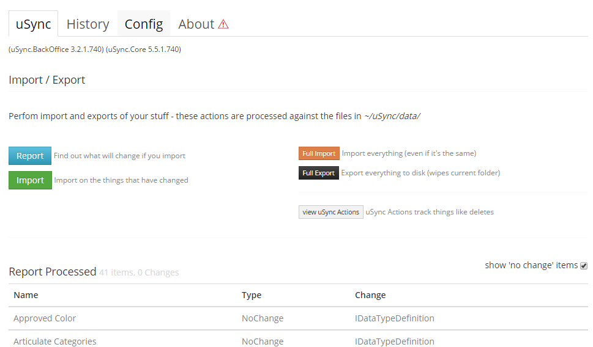

# Getting Started

At the basic level, uSync 'just works' out of the box. 


## First Run
The first time you run your Umbraco site after installing uSync. uSync will
perform an export of your settings from the site. 

**uSync will export:** 

- Document Types
- Data Types
- Media Types
- Templates
- Macros
- Languages (v7)
- Dictionary Items (v7)
- Member Types *(disabled by default)*

**uSync.ContentEdition exports**

- Content
- Media
- Domains
- Content Templates (blueprints)
- Languages(v8)
- Dictionary Items (v8)

The export will be placed in the ```uSync/data``` folder within your Umbraco site. (in v8 ```usync\v8```)

## Export On Save / Delete
Once uSync is running it will listen for events related to saving or deleting 
of items within Umbraco. 

Every time you save an item uSync will write out an export file for the item
in the ```uSync/data``` folder. 

When you delete an item, an entry is made into the ```uSyncActions.config``` file
that tracks deletes. This file is used during an import, to process the delete
on other Umbraco instances.

## Import On Startup
By default, uSync will run an import every time your Umbraco site starts (or the
application pool refreshes). 

During an import uSync looks at the files in the ```uSync/data``` folder and compares
them with the items within the Umbraco site. 

If there are any differences then uSync applies the values from disk to Umbraco, 
so this way things are kept in sync. 

## uSync Dashboard

The uSync dashboard gives you a place to see what uSync is doing, run manual
imports or exports and check settings. 



The dashboard is located in the Developer section of Umbraco. 
